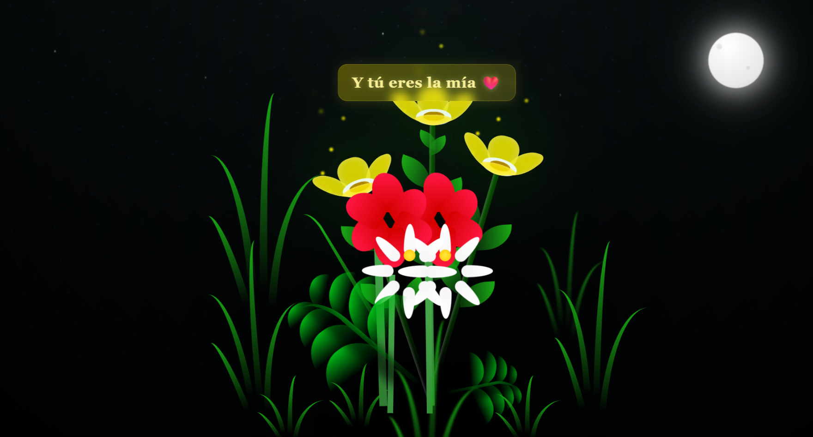

# Jardín Nocturno de Flores 🌙

Este es un simple proyecto web que muestra una hermosa animación de un jardín de flores en la noche, creado completamente con HTML y CSS.

## 📜 Descripción

La escena presenta un cielo nocturno estrellado con una luna brillante. En primer plano, diversas flores (amarillas, rojas y blancas) y hierba crecen y se mecen suavemente. La animación incluye efectos de luces y mensajes que aparecen de forma secuencial para dar un toque especial y emotivo.

## ✨ Características

-   **Animaciones CSS puras:** Todas las animaciones se realizan con CSS, incluyendo el crecimiento de las flores, el parpadeo de las estrellas y el brillo de la luna.
-   **Diseño Responsivo:** Se adapta a diferentes tamaños de pantalla.
-   **Mensajes animados:** Muestra mensajes secuenciales con efectos de aparición y desaparición.
-   **Efecto Parallax:** Un sutil efecto de movimiento en la luna y las flores al mover el mouse, creando una sensación de profundidad.

## 📸 Captura de Pantalla

## 🚀 Cómo usar

Simplemente abre el archivo `index.html` en tu navegador web preferido para ver la animación.

---
Creado con ❤️
